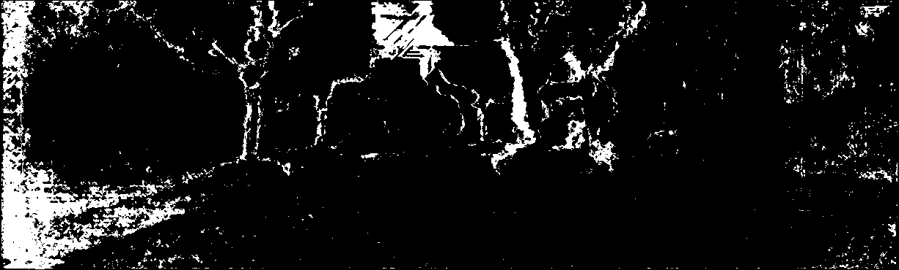
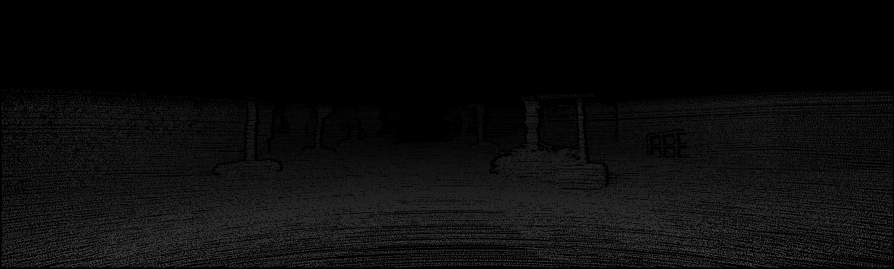
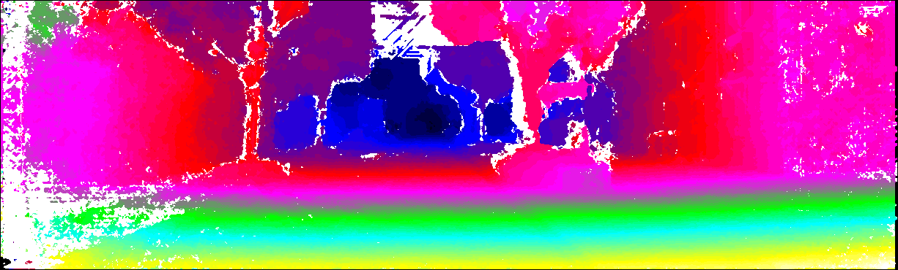
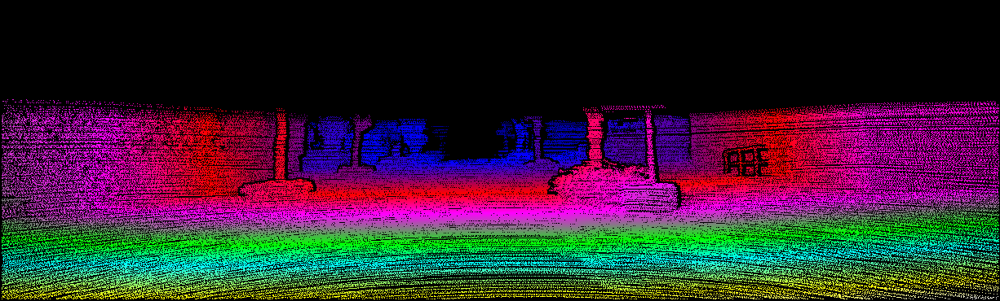
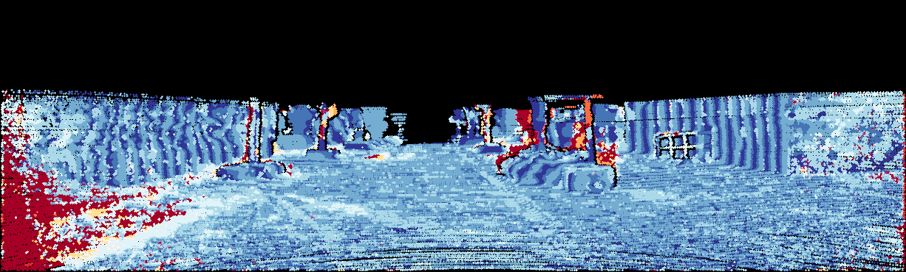

> The evalution and color code for kitti.

#### 0. Software Environment
matlab >= 2015

#### 2. How to use the code:
run the main.m file;
```
$ matlab main.m
```
#### 3. The result
- The input image:



- The input gt:



- The output color disp map:



- The output color gt:



- The output error map:



#### 3. File Structure
```
.
├── src # source code
│   ├── libs/
│   ├── main.m
│   └── ...
├── LICENSE
└── README.md
```

